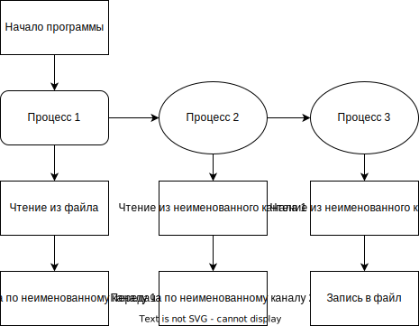
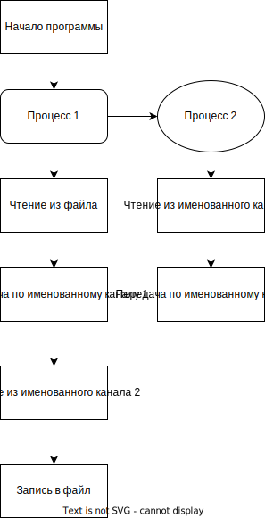
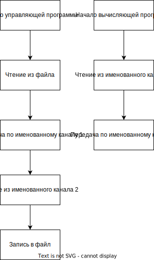
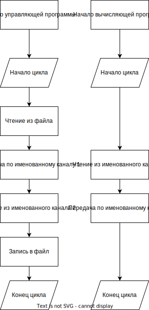
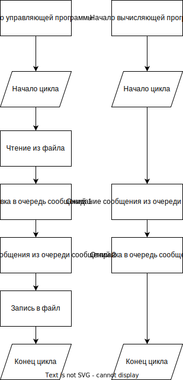

# ИДЗ-1

## Коледаев Алексей Дмитриевич, БПИ-213

## Условие:

**Разработать программу, находящую в заданной ASCII-строке первую
слева направо последовательность N символов, каждый элемент
которой определяется по условию «меньше предшествующего» (N
вводится как отдельный параметр).**

Дополнительно реализована [программа генерации тестов](./tests/tests.c)

# На 4:

1. Схема задачи:

   

2. Для задания имен входного и выходного файлов используются аргументы командной строки формат `name [in_file] [out_file]`
3. Ввод и вывод данных при работе с файлами осуществляется через
   системные вызовы `read` и `write`
4. Размер буфера хранения - 8192 байт
5. [Тесты](./tests/txt)
6. [Результаты тестов](./4/tests/)

# На 5:

1. Схема задачи:

   

2. Для задания имен входного и выходного файлов используются аргументы командной строки формат `name [in_file] [out_file]`
3. Ввод и вывод данных при работе с файлами осуществляется через
   системные вызовы `read` и `write`
4. Размер буфера хранения - 8192 байт
5. [Тесты](./tests/txt)
6. [Результаты тестов](./5/tests/)

# На 6:

1. Схема задачи:

   

2. Для задания имен входного и выходного файлов используются аргументы командной строки формат `name [in_file] [out_file]`
3. Ввод и вывод данных при работе с файлами осуществляется через
   системные вызовы `read` и `write`
4. Размер буфера хранения - 8192 байт
5. [Тесты](./tests/txt)
6. [Результаты тестов](./6/tests/)

# На 7:

1. Схема задачи:

   

2. Для задания имен входного и выходного файлов используются аргументы командной строки формат `name [in_file] [out_file]`
3. Ввод и вывод данных при работе с файлами осуществляется через
   системные вызовы `read` и `write`
4. Размер буфера хранения - 8192 байт
5. [Тесты](./tests/txt)
6. [Результаты тестов](./7/tests/)

# На 8:

1. Схема задачи:

   

2. Для задания имен входного и выходного файлов используются аргументы командной строки формат `name [in_file] [out_file]` (`processor` запускается без аргументов кс)
3. Ввод и вывод данных при работе с файлами осуществляется через
   системные вызовы `read` и `write`
4. Размер буфера хранения - 8192 байт
5. [Тесты](./tests/txt)
6. [Результаты тестов](./8/tests/)

# На 9:

1. Схема задачи:

   

2. Для задания имен входного и выходного файлов используются аргументы командной строки формат `name [in_file] [out_file]` (`processor` запускается без аргументов кс)
3. Ввод и вывод данных при работе с файлами осуществляется через
   системные вызовы `read` и `write`
4. Размер буфера хранения - 200 байт
5. [Тесты](./tests/txt)
6. [Результаты тестов](./9/tests/)

# На 10:

1. Схема задачи:

   

2. Для задания имен входного и выходного файлов используются аргументы командной строки формат `name [in_file] [out_file]` (`processor` запускается без аргументов кс)
3. Ввод и вывод данных при работе с файлами осуществляется через
   системные вызовы `read` и `write`
4. Размер буфера хранения - 200 байт
5. [Тесты](./tests/txt)
6. [Результаты тестов](./10/tests/)
